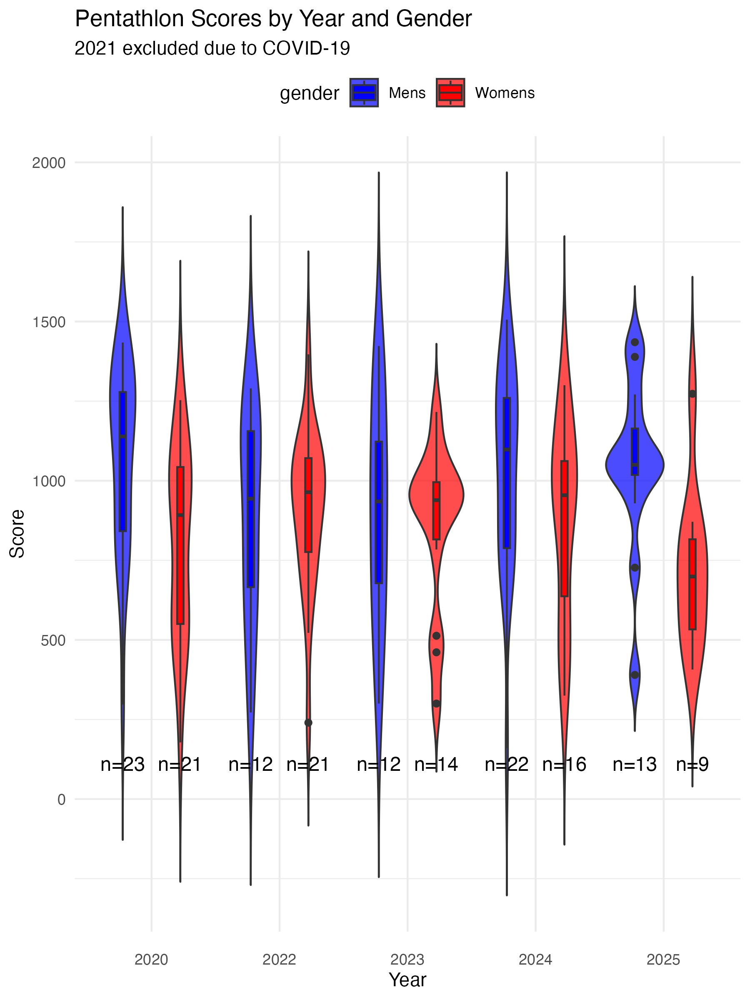
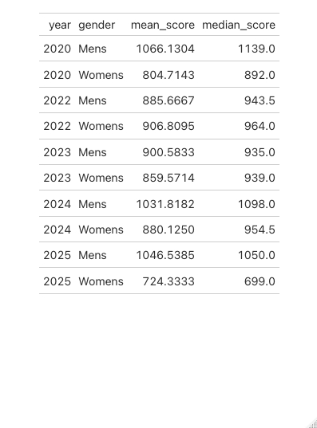
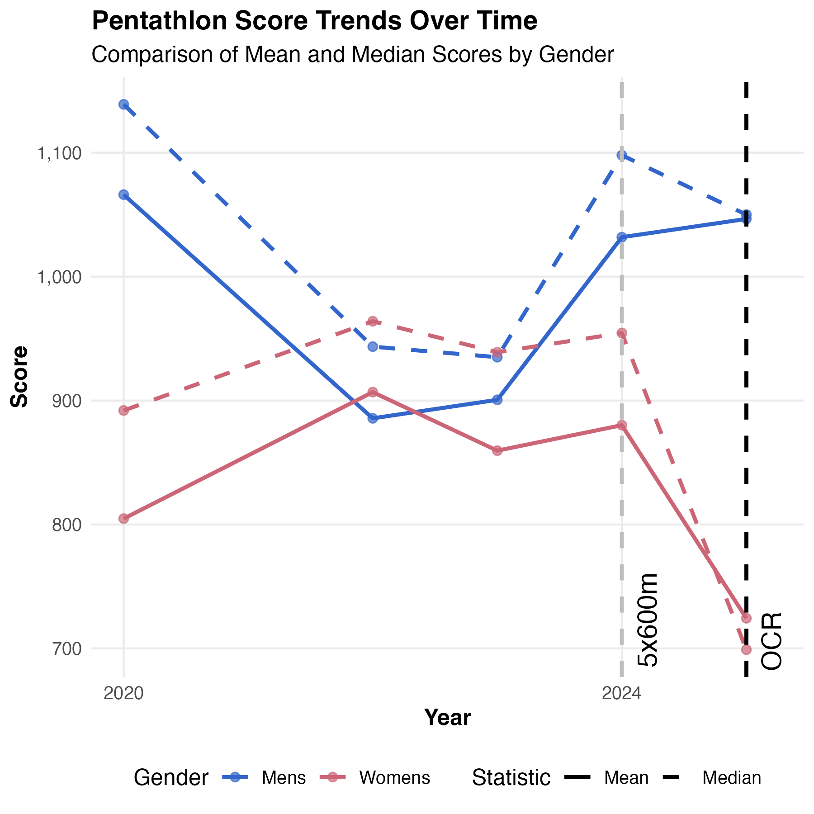
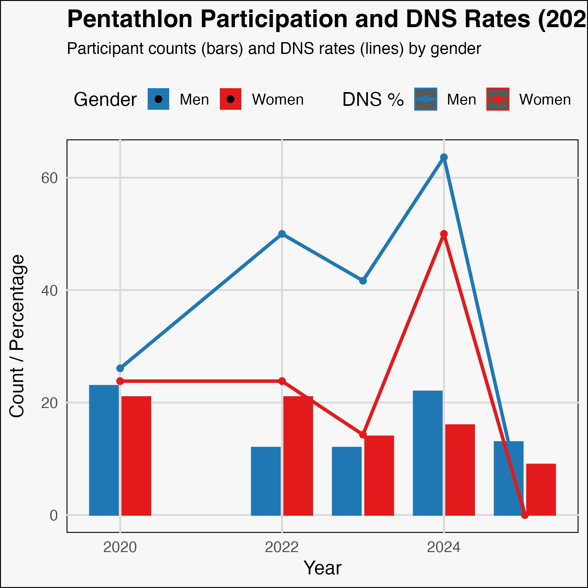
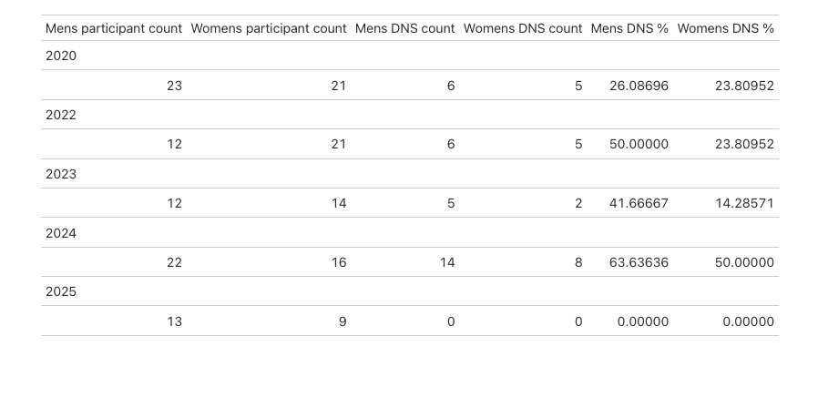
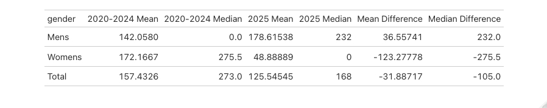
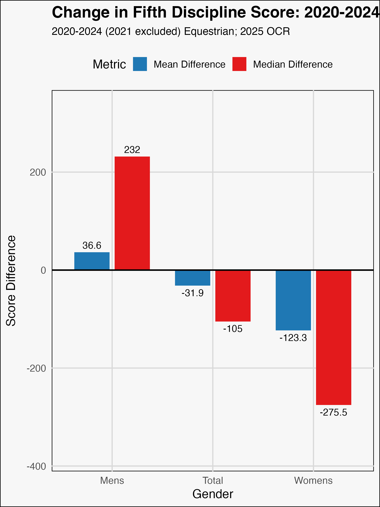

# OCR-Scoring

## Data
Data sourced from https://www.oxbridgepentathlon.org.uk/bucs/#documentarchive 2025-03-24.
Data from 2020, 2022, 2023, 2024, and 2025 scraped. 2021 competition did not occur due to COVID-19.

## Results

  
  

Although the above is a limited sample size, it indicates a deviation from the typical score distributions to previous years.

The ladies had a lower mean score than in previous years with a large tail distribution towards lower scoring.

The above line plots track the mean (solid line) and median (broken line) scores over the years for men (blue) and women (red). The mean score is sensitive to outliers, as is the case with many DNS or eliminations in the equestrian event, so the median score is plotted as well. 

For the ladies, both the mean and median scores were lower in 2025 than in previous years (2020-2024). The median was actually lower than the mean, suggesting that although there were some high scoring women, on the whole scores were much lower than in previous years.

 

The DNS rate in 2025 was 0% for both the men and the women. More people are participating in the fifth discipline.

 
 

When comparing the equestrian period (2020-2024) to the OCR period (2025), the men and women's mean scores have increased and decreased respectively (men's: +36.55 points; women's: -123 points).
The median figures in these cases are affected by the very high rates of DNS in the men's riding (26-63%) and the high elimination rate in women's OCR (7/9; 78%).

# Discussion
## Men
Together the overall Pentathlon Score statistics suggest a declining median for the men but a rising mean, which may be interpreted as a increase in the number of people participating in the fifth discipline but not scoring as highly as in the equestrian era. This is likely due to a kind of survivor bias in the equestrian discipline where men who participated often did well, notwithstanding regular eliminations.
The mean score of the fifth discipline has increased by 36.55 points but the median has declined, suggesting an inflation of men's scores.

## Women
The women have also had a decrease in DNS figures but dramatic increase in DNF/elimination results, with huge declines in the fifth discipline scores between the equestrian period (2020-2024) and the OCR period (2025).

# Conclusion
Both the men and women have experienced changes in outcomes owing to the OCR discipline but to differing ends. More men are participating in the OCR, increased mean score, but are not performing as well, indicating inflation of mens scores.
The women also have higher rates of participation but large, global losses in the fifth discipline of approximately 123 points on average.

